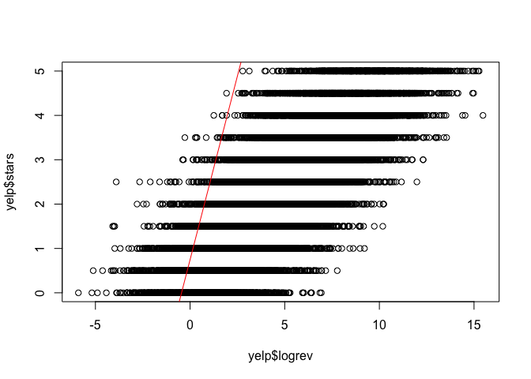

Overview
========

Often times, I find myself going on Yelp searching for the newest and highest rating restaurant in my area. I always look for resturants that are rated 4 and above, and usually when I see a score less than 4, I do not consider it in my list of potential restaurants. This made me wonder, how are these ratings affecting business for these restaurants. If most people are like myself, it must have tremondous impact on their revenue.

The question I am interested in is then:

All things being equal, does an additional star on yelp increase business, and by how much?

I have a dataset that is provided by yelp containing 15,000 different restaurants and the scores they currently have on yelp. In this project, I attempt to understand the relationship between score and revenue by using linear regression. I start with the simple linear regression model, then try more complex models such as panel data, while adding more assumptions to make it more rigorous and closer to real life.

Variables: **logrev**: log of the revenue **score**: average of user's reviews **stars**: number of stars on yelp **rest\_id**: restaruant id **time\_id**: quarter identifier

``` r
library(ggplot2)
library(stats)
library(sm)
```

    ## Package 'sm', version 2.2-5.6: type help(sm) for summary information

``` r
library(sandwich)
library(lmtest)
```

    ## Loading required package: zoo

    ## 
    ## Attaching package: 'zoo'

    ## The following objects are masked from 'package:base':
    ## 
    ##     as.Date, as.Date.numeric

``` r
library(plm)
```

    ## Loading required package: Formula

``` r
library(MASS)
```

    ## 
    ## Attaching package: 'MASS'

    ## The following object is masked from 'package:sm':
    ## 
    ##     muscle

``` r
library(nlme)

# removes any global environment variables
rm(list=ls())

load("source-code/yelp.RData")
```

Naive regression, regress revenue on stars:

logrev = β\_0 + β\_1 score + U\_it

Assumption: 1) E(U|stars) = 0

``` r
m1 = lm(logrev ~ score, data = yelp)
summary(m1)
```

    ## 
    ## Call:
    ## lm(formula = logrev ~ score, data = yelp)
    ## 
    ## Residuals:
    ##     Min      1Q  Median      3Q     Max 
    ## -8.5878 -1.4398  0.0176  1.4320  7.7718 
    ## 
    ## Coefficients:
    ##             Estimate Std. Error t value Pr(>|t|)    
    ## (Intercept)  0.69388    0.03372   20.58   <2e-16 ***
    ## score        1.73467    0.01145  151.46   <2e-16 ***
    ## ---
    ## Signif. codes:  0 '***' 0.001 '**' 0.01 '*' 0.05 '.' 0.1 ' ' 1
    ## 
    ## Residual standard error: 2.105 on 14998 degrees of freedom
    ## Multiple R-squared:  0.6047, Adjusted R-squared:  0.6046 
    ## F-statistic: 2.294e+04 on 1 and 14998 DF,  p-value: < 2.2e-16

``` r
plot(yelp$logrev, yelp$stars)
abline(m1, col = "red")
```


Interpretation: if a restaurant's star rating were to increase by 1, then the restaurant's logrev would increase by (1.73 \* 100)% = 173%.

OVB (Omitted Variable Bias):

Stars are most likely a function composed of the quality of the food as well as the price. People are more likely to judge quality relative to the price they pay.

Let's rewrite regression using panel data:

logrev = α\_i + α\_t + β score\_it + U\_it

Assumptions: 1) E(U\_it|stars\_it) = 0 AND E(U\_it|stars\_i1, ..., stars\_iT, α\_i) = 0 2) Strict exogenity, no feedback from U\_it and score across time.

``` r
# within -> fixed effects
m2 = plm(logrev ~ stars, data=yelp, index=c('rest_id','time'), method = 'within', effect="individual")
summary(m2)
```

    ## Oneway (individual) effect Within Model
    ## 
    ## Call:
    ## plm(formula = logrev ~ stars, data = yelp, effect = "individual", 
    ##     index = c("rest_id", "time"), method = "within")
    ## 
    ## Balanced Panel: n = 1500, T = 10, N = 15000
    ## 
    ## Residuals:
    ##       Min.    1st Qu.     Median    3rd Qu.       Max. 
    ## -9.3692704 -1.3282481 -0.0057836  1.3460210  7.0751650 
    ## 
    ## Coefficients:
    ##       Estimate Std. Error t-value  Pr(>|t|)    
    ## stars 1.723688   0.031768  54.258 < 2.2e-16 ***
    ## ---
    ## Signif. codes:  0 '***' 0.001 '**' 0.01 '*' 0.05 '.' 0.1 ' ' 1
    ## 
    ## Total Sum of Squares:    71199
    ## Residual Sum of Squares: 58451
    ## R-Squared:      0.17904
    ## Adj. R-Squared: 0.087815
    ## F-statistic: 2943.93 on 1 and 13499 DF, p-value: < 2.22e-16

``` r
plot(yelp$logrev, yelp$stars)
abline(m2, col = "red")
```


Interpretation: Holding all control variables and state fixed effects constant, increasing the star rating by 1 will increase revenues by (1.72 \* 100)% = 172%.

Other factors might affect the revenue (OVB). To enforce causality, we need to show that rounding scores up affects the revenue. Yelp rounds scores to the nearest half star. For example, when a user searches for 4 star restaruant, only scores with 3.75 and above will show; if it is 3.74 it will round down to 3.5 stars. Thus, we define a binary variable *roundedUp* that denotes restaurants that is 1 when the score is rounded up, otherwise, it is rounded down.

``` r
temp = yelp$score[   (yelp$score >= 0.25 & yelp$score <= 0.49) |
                  (yelp$score >= 0.75 & yelp$score <= 0.99) |
                  (yelp$score >= 1.25 & yelp$score <= 1.49) | 
                  (yelp$score >= 1.75 & yelp$score <= 1.99) |
                  (yelp$score >= 2.25 & yelp$score <= 2.49) |
                  (yelp$score >= 2.75 & yelp$score <= 2.99) |
                  (yelp$score >= 3.25 & yelp$score <= 3.49) |
                  (yelp$score >= 3.75 & yelp$score <= 3.99) |
                  (yelp$score >= 4.25 & yelp$score <= 4.49) |
                  (yelp$score >= 4.75 & yelp$score <= 4.99) ]

yelp$roundedUp <-  ifelse(yelp$score %in% temp, 1, 0)

# estimate treatment affect of restaurants recieving 0.5 star increment
m3 = plm(logrev ~ factor(roundedUp) + score, data = yelp, index=c("rest_id","time"), method= "within",effect="individual")
summary(m3)
```

    ## Oneway (individual) effect Within Model
    ## 
    ## Call:
    ## plm(formula = logrev ~ factor(roundedUp) + score, data = yelp, 
    ##     effect = "individual", index = c("rest_id", "time"), method = "within")
    ## 
    ## Balanced Panel: n = 1500, T = 10, N = 15000
    ## 
    ## Residuals:
    ##      Min.   1st Qu.    Median   3rd Qu.      Max. 
    ## -9.451692 -1.330432 -0.010249  1.341242  7.271747 
    ## 
    ## Coefficients:
    ##                    Estimate Std. Error t-value  Pr(>|t|)    
    ## factor(roundedUp)1 0.746705   0.036319  20.560 < 2.2e-16 ***
    ## score              1.655351   0.032794  50.477 < 2.2e-16 ***
    ## ---
    ## Signif. codes:  0 '***' 0.001 '**' 0.01 '*' 0.05 '.' 0.1 ' ' 1
    ## 
    ## Total Sum of Squares:    71199
    ## Residual Sum of Squares: 58199
    ## R-Squared:      0.18259
    ## Adj. R-Squared: 0.091688
    ## F-statistic: 1507.53 on 2 and 13498 DF, p-value: < 2.22e-16

``` r
plot(yelp$logrev, yelp$stars)
abline(m3, col = "red")
```



Interpretation: Holding all control variables and state fixed effects constant, having a restaurant's score being rounded up will increasing will increase revenues by (1.65 \* 100)% = 165%.

Conclusion
==========

We started by asking the question of how does yelp ratings affect revenue. Our solution provided us with the information that having a restaurant's score being rounded up on Yelp will increase revenues by 165%! Although this may be a large number, and might not be completely accurate, it does confirm with us that indeed Yelp does affect business revenue. So next time you are on Yelp, and are searching for restaurant's, remember that you are impacting their business!

Ways to Improve
---------------

1.  Add more assumptions to make analysis more rigorous.
2.  Try to see how other features on Yelp have an impact on revenue.
3.  Explore Time Series Analysis.
